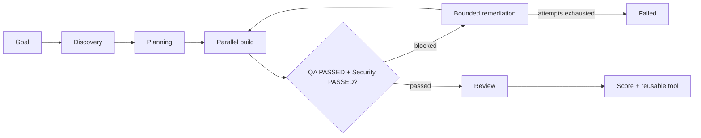

# SDLC

SDLC is a local, OpenAI-powered software delivery control plane. It turns a goal into a bounded
delivery workflow, runs specialist agents, requires runtime and security evidence, exposes local
observability, and publishes only approved artifacts as reusable tools. The repository also contains
the file-first LLM Wiki used as an evidence source for delivery decisions.

## Software Factory quick start

```powershell
Copy-Item .env.example .env
# Set OPENAI_API_KEY in .env
.\scripts\start-factory.ps1 -Build
```

Open `http://localhost:8000` and submit:

```text
Create an accessible Hello World page that runs locally without external dependencies.
```

The local stack includes the Factory UI (`:8000`), Jaeger v2 (`:16686`), Grafana (`:3000`), and
Prometheus (`:9090`). See [Software Factory Architecture](docs/architecture.md),
[FSM and Agents](docs/fsm-and-agents.md), [Reusable Tools](docs/reusable-tools.md),
[Observability and Scoring](docs/observability-and-scoring.md), and
[Local Factory Development](docs/factory-local-development.md). Run details are defined by the
[Session Artifact Specification](docs/session-artifact.md), while uploaded prompt documents follow
[Prompt Source Ingestion](docs/prompt-ingestion.md).

After all gates pass, the UI exposes the generated frontend at a session-specific localhost preview
URL. The delivery also includes `deploy/compose.yaml` and Docker assets for running the exported
project independently. Upload-ready general prompts are available in [`prompt_library/`](prompt_library/README.md).



## File wiki

LLM Wiki is a repository-scoped agent skill that turns source files into a persistent,
interlinked, evidence-backed Markdown wiki. It follows the compile-on-ingest pattern: knowledge is
integrated once, maintained across sessions, and queried from the accumulated wiki.

The project is file-first. There is no application server or database. Codex discovers the skill
from `.agents/skills/llm-wiki`, chooses relevant installed file-processing skills, and maintains
the wiki directly. A small Python toolkit handles deterministic hashing, indexing, link graphs,
search, and validation without making semantic decisions.

See the [architecture guide](docs/architecture.md) for system boundaries, ingestion and query
sequences, the persistence model, trust boundaries, Docker deployment, and extension points.
Use the [local testing guide](docs/local-testing.md) for a complete Docker smoke test, first ingest,
cited query, contradiction review, and source-skill routing exercise.

## Workspace

```text
.agents/skills/llm-wiki/   Agent workflow, routing, and schemas
raw/                       Immutable content-addressed sources
wiki/sources/              Source summaries and evidence anchors
wiki/entities/             Canonical named entities
wiki/concepts/             Cross-source concepts
wiki/syntheses/            Reusable analyses and answers
wiki/index.md              Generated navigation index
wiki/overview.md           Living high-level synthesis
wiki/log.md                Append-only operation history
.llm-wiki/                 Deterministic local state and schema overrides
graph/graph.json            Generated wikilink graph
```

## Skill selection

The `llm-wiki` skill does not hard-code one parser for every format. Before ingesting a non-text
source, it examines the skills available to the current agent and loads the smallest relevant set.
For example, a PDF skill handles a PDF, a spreadsheet skill handles XLSX, and a document skill
handles DOCX. This preserves each specialist workflow and keeps irrelevant instructions out of
context.

Missing skills are never installed automatically. The Docker toolkit carries common conversion
libraries, but the agent reports formats it still cannot process safely.

## Requirements

- Windows 10/11, macOS, or Linux
- Codex CLI or the Codex IDE extension
- Docker Engine with Docker Compose support for the portable toolkit
- PowerShell 7 is recommended for Windows bootstrap

The skill runs inside Codex and does not call a separate LLM API, so interactive use does not need
a project-level API key.

## Quick start on Windows

Open PowerShell in the repository directory:

```powershell
Set-ExecutionPolicy -Scope Process Bypass
.\scripts\bootstrap.ps1
```

The script checks Docker, builds the deterministic toolkit, and initializes the file workspace. If
Docker Desktop is missing and `winget` is available:

```powershell
.\scripts\bootstrap.ps1 -InstallPrerequisites
```

After Docker Desktop completes first-run setup, run the first command again. Python is not required
for this Docker-based workflow.

## Manual setup

```bash
docker build -t llm-wiki:local .
docker run --rm -v "$PWD:/workspace" llm-wiki:local --root /workspace init
```

## Agent workflow

Open Codex in the repository and invoke the skill explicitly:

```text
$llm-wiki ingest examples/architecture.md
```

Implicit invocation also works:

```text
Ingest examples/architecture.md into the wiki.
What does the wiki say about the primary knowledge store?
Check the wiki for contradictions and stale claims.
```

The skill selects an ingest, query, or lint workflow and loads only the relevant references. During
ingest it also selects specialized installed skills based on file type and requested operation.

The repository includes focused adapters for PDF, DOCX/PPTX, and XLSX/CSV/TSV. See
[Custom Source Skills](docs/custom-skills.md) to create another adapter, define its handoff contract,
and verify explicit and automatic selection.

## Toolkit commands

```bash
llm-wiki --root . init
llm-wiki --root . register examples/architecture.md
llm-wiki --root . extract examples/architecture.md
llm-wiki --root . search "knowledge store"
llm-wiki --root . index
llm-wiki --root . graph
llm-wiki --root . lint
llm-wiki --root . status
```

Through Docker:

```bash
docker run --rm -v "$PWD:/workspace" llm-wiki:local --root /workspace status
docker run --rm -v "$PWD:/workspace" llm-wiki:local --root /workspace lint
```

The toolkit deliberately does not generate knowledge. The agent owns semantic extraction,
reconciliation, page updates, and contradiction handling.

## Local development

Python 3.12 or newer is required. Using `uv` is recommended:

```bash
uv venv
uv pip install -e ".[dev,converters]"
pytest
ruff check .
mypy src
```

Pull requests run unit tests and Ruff through GitHub Actions. Tests do not call an LLM or require
credentials.

## Operating principles

- Raw sources are immutable and content-addressed.
- The agent reads the existing wiki before changing it.
- New evidence updates all genuinely affected pages.
- Generated pages never become their own factual source.
- Contradictions and uncertainty remain visible.
- Deterministic lint runs after every mutation.
- Human review remains appropriate for consequential conclusions.

## License

Released under the [MIT License](LICENSE).
