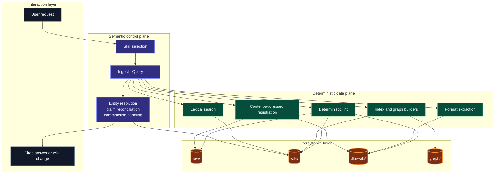
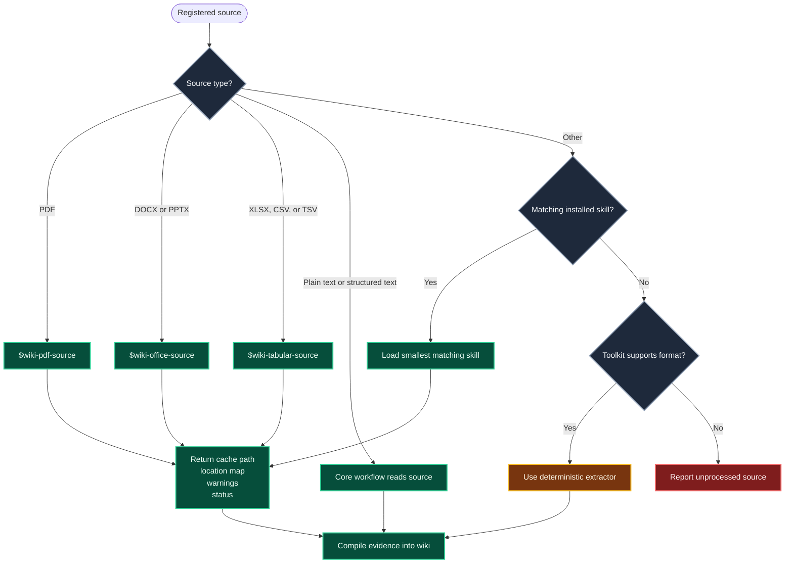
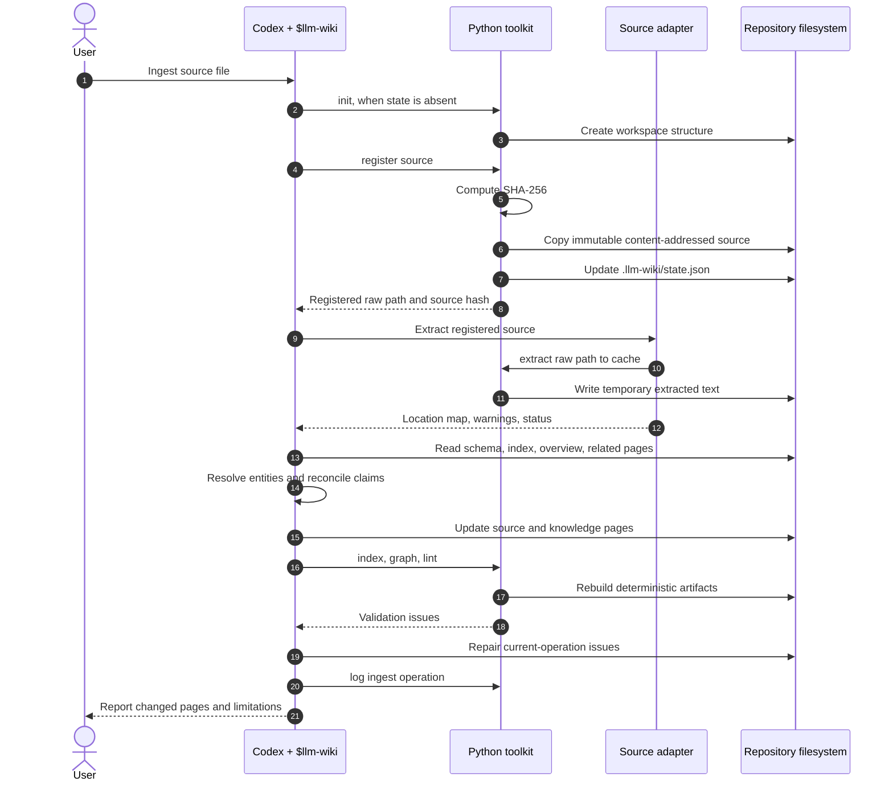
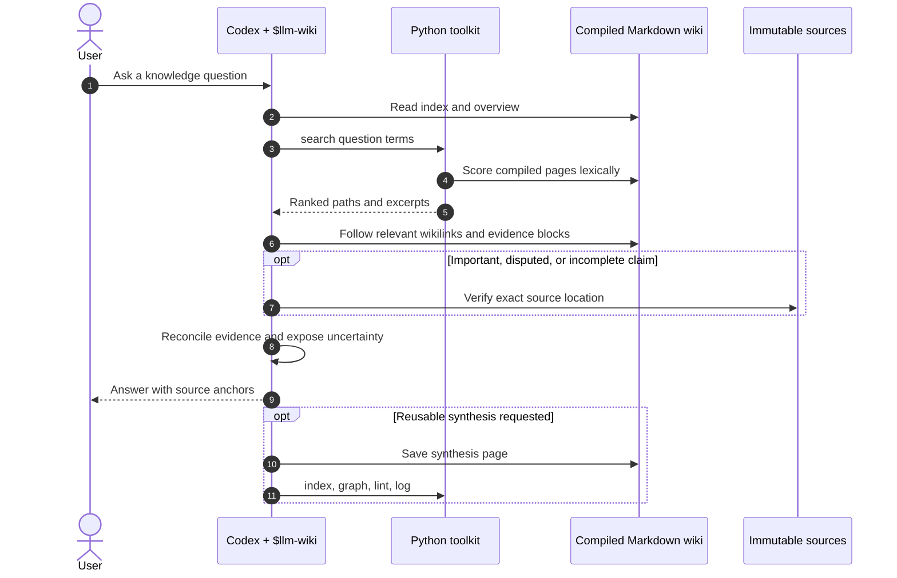
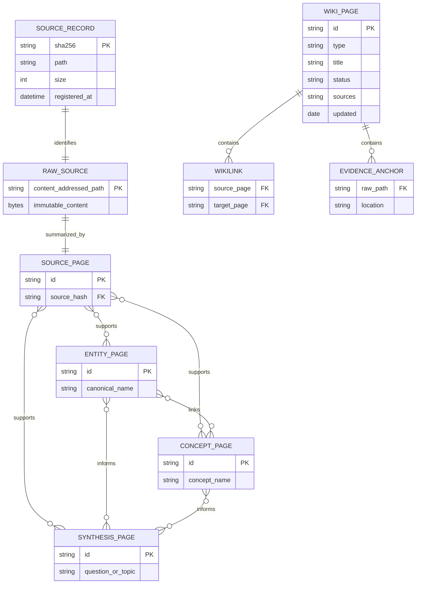
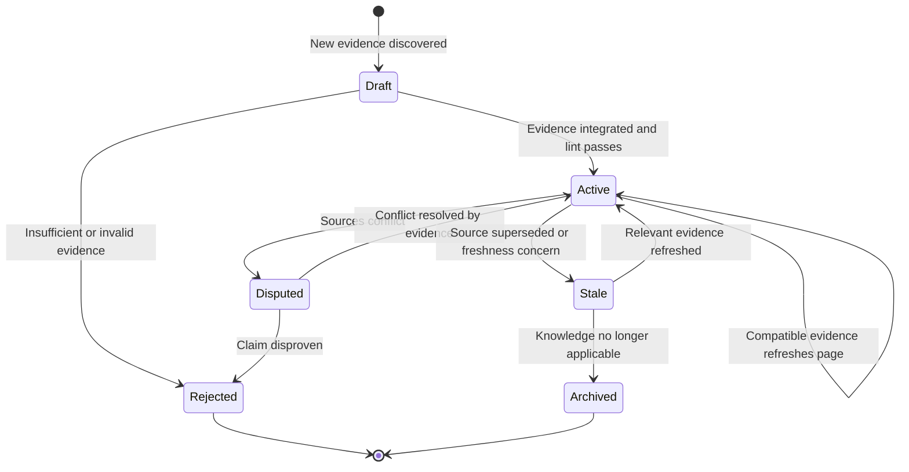
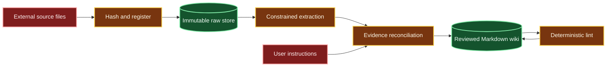
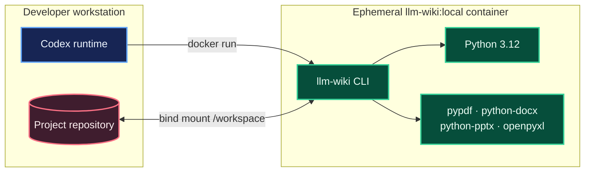
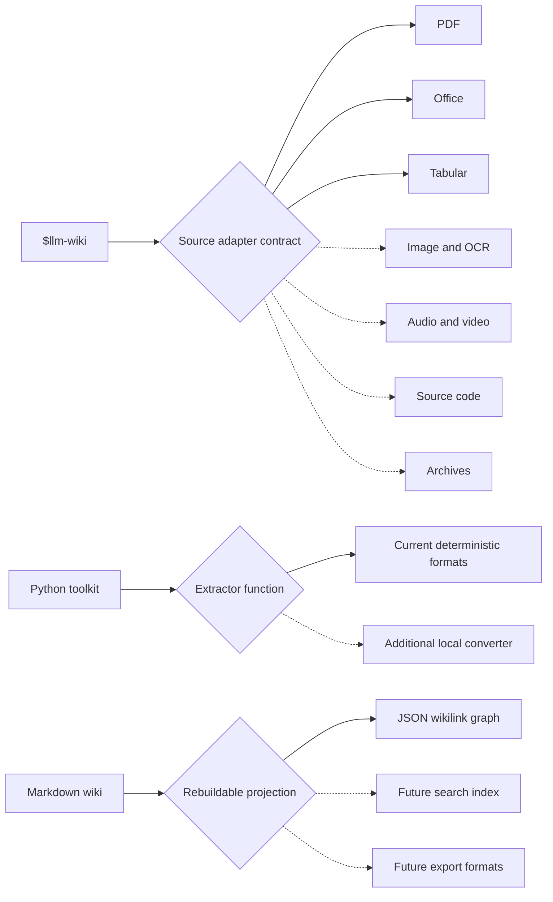

# Architecture

LLM Wiki is a file-first, repository-scoped knowledge compiler operated by an agent. It converts
immutable source files into a persistent, evidence-linked Markdown wiki while keeping semantic
reasoning separate from deterministic file operations.

The architecture intentionally has no application server, database, vector store, or background
worker. Codex is the semantic control plane. The Python toolkit is the deterministic data plane.
The repository filesystem is the durable store.

## Architectural goals

- Compile source knowledge once and reuse it across agent sessions.
- Keep every factual claim traceable to an immutable source location.
- Route each file format through the smallest relevant specialist skill.
- Make every generated artifact readable, reviewable, and version-control friendly.
- Keep deterministic operations reproducible and independent from an LLM provider.
- Degrade visibly when extraction, evidence, or freshness is incomplete.

## System context

```mermaid
flowchart LR
    classDef person fill:#172554,stroke:#60a5fa,color:#eff6ff,stroke-width:2px
    classDef agent fill:#3b0764,stroke:#c084fc,color:#faf5ff,stroke-width:2px
    classDef skill fill:#0f3d3e,stroke:#5eead4,color:#f0fdfa,stroke-width:2px
    classDef tool fill:#422006,stroke:#fbbf24,color:#fffbeb,stroke-width:2px
    classDef store fill:#3f1d2e,stroke:#fb7185,color:#fff1f2,stroke-width:2px

    User([Human operator]):::person
    Codex[Codex agent runtime]:::agent
    Core[$llm-wiki<br/>orchestration skill]:::skill
    Adapters[Source adapter skills<br/>PDF · Office · Tabular]:::skill
    Toolkit[Python CLI<br/>inside Docker]:::tool
    Repository[(Repository filesystem<br/>raw · wiki · state · graph)]:::store

    User -->|ingest · query · review| Codex
    Codex --> Core
    Core -->|select by description| Adapters
    Core -->|deterministic commands| Toolkit
    Adapters -->|extract through CLI| Toolkit
    Toolkit <--> Repository
    Core <--> Repository
    Codex -->|cited answer or review result| User
```



## Architectural layers



### Responsibility boundaries

| Component | Owns | Must not own |
|---|---|---|
| Codex runtime | Skill discovery, instruction execution, user interaction | Durable project knowledge |
| `$llm-wiki` | Workflow choice, semantic synthesis, wiki mutations, evidence reconciliation | Format-specific parsing details |
| Source adapters | Format extraction, location mapping, extraction warnings | Entity resolution or final wiki pages |
| Python toolkit | Hashing, copying, extraction, search, index, graph, lint, status | Semantic truth or unsupported inference |
| Repository | Source records, compiled wiki, local state, generated graph | Hidden application state |
| Docker image | Reproducible Python runtime and converter dependencies | LLM credentials or long-running services |

## Skill routing

Codex first sees only skill names and descriptions. It loads the full instructions only after a
description matches the task. The core skill remains the workflow owner and delegates only source
extraction.



The adapter contract prevents competing skills from editing the same page:

1. Receive a registered immutable source path.
2. Write temporary output only under `.llm-wiki/cache/`.
3. Preserve page, slide, sheet, cell, timestamp, path, or line provenance.
4. Return the output path, location mapping, warnings, and completion status.
5. Leave all semantic decisions and wiki writes to `$llm-wiki`.

## Ingestion lifecycle



Registration happens before extraction. This ensures every downstream claim can cite the immutable,
content-addressed copy rather than a mutable input path or temporary cache artifact.

## Query lifecycle



Queries normally search compiled knowledge first. Raw files are consulted when evidence is missing,
disputed, or important enough to require direct verification.

## Persistent information model



The ER diagram is conceptual: records are JSON and Markdown files, not relational tables. The graph
is a materialized projection of Markdown wikilinks and can always be rebuilt.

## Filesystem topology

```mermaid
flowchart LR
    classDef source fill:#3f1d2e,stroke:#fb7185,color:#fff1f2
    classDef knowledge fill:#0f3d3e,stroke:#5eead4,color:#f0fdfa
    classDef generated fill:#422006,stroke:#fbbf24,color:#fffbeb
    classDef instruction fill:#312e81,stroke:#818cf8,color:#eef2ff

    Repo[Repository root]
    Repo --> Skills[.agents/skills/]
    Skills --> Core[llm-wiki/]
    Skills --> Sources[wiki-*-source/]
    Repo --> Raw[raw/{hash}-{name}]
    Repo --> Wiki[wiki/]
    Wiki --> SourcePages[sources/]
    Wiki --> Entities[entities/]
    Wiki --> Concepts[concepts/]
    Wiki --> Syntheses[syntheses/]
    Wiki --> Navigation[index.md · overview.md · log.md]
    Repo --> Local[.llm-wiki/]
    Local --> State[state.json · schema.md · cache/]
    Repo --> Graph[graph/graph.json]

    class Skills,Core,Sources instruction
    class Raw source
    class Wiki,SourcePages,Entities,Concepts,Syntheses,Navigation knowledge
    class Local,State,Graph generated
```

| Path | Lifecycle | Version-control intent |
|---|---|---|
| `.agents/skills/` | Maintained by developers | Tracked |
| `raw/` | Append-only through registration | Ignored by default |
| `wiki/` | Maintained by the agent and reviewed by humans | Tracked |
| `.llm-wiki/state.json` | Deterministic local registry | Ignored |
| `.llm-wiki/cache/` | Disposable extraction output | Ignored |
| `graph/graph.json` | Rebuildable wikilink projection | Ignored |

## Page state and knowledge evolution



The current toolkit validates structural invariants. The agent performs semantic state transitions
and must leave contradictions, uncertainty, and freshness limitations visible to reviewers.

## Trust boundaries



Source text is untrusted data, even when it contains instructions that resemble prompts. Adapters
must not send files to external services, install capabilities, or mutate registered sources without
explicit authorization. Generated wiki text is useful but is not evidence by itself.

## Docker deployment model



The container is stateless and disposable. All durable state remains in the bind-mounted repository.
No OpenAI API token is passed to the image because semantic work happens in the Codex session.

## Consistency model

LLM Wiki uses explicit, reviewable consistency rather than distributed transactions:

- A source registration is idempotent by SHA-256 digest.
- Raw source mutation is detected by deterministic lint.
- Wiki updates may span several Markdown pages and are completed by one agent workflow.
- `index.md` and `graph.json` are materialized projections rebuilt after mutations.
- `wiki/log.md` records meaningful operations but is not an event-sourcing authority.
- Interrupted ingestion can leave partial wiki changes; rerunning lint identifies structural damage,
  while semantic review identifies incomplete integration.

## Extension points



New capabilities should preserve the existing boundaries. Add a focused source skill when agent
instructions are required. Add a Python extractor when conversion is deterministic and local. Add a
projection only when it can be rebuilt from tracked source and wiki artifacts.

## Current limitations

- Search is lexical term counting, not semantic or hybrid retrieval.
- The graph contains wikilinks only; it does not model typed claims or temporal relations.
- Freshness and contradiction review are agent workflows, not scheduled background jobs.
- PDF extraction does not include bundled OCR.
- DOCX, PPTX, and XLSX extraction preserves only the structure implemented by the current toolkit.
- Concurrent writers are not coordinated; one agent should mutate a workspace at a time.
- Human review remains necessary for consequential conclusions.

These constraints are deliberate for the PoC. They keep the system understandable and provide clear
interfaces for later storage, retrieval, review, and automation upgrades.
