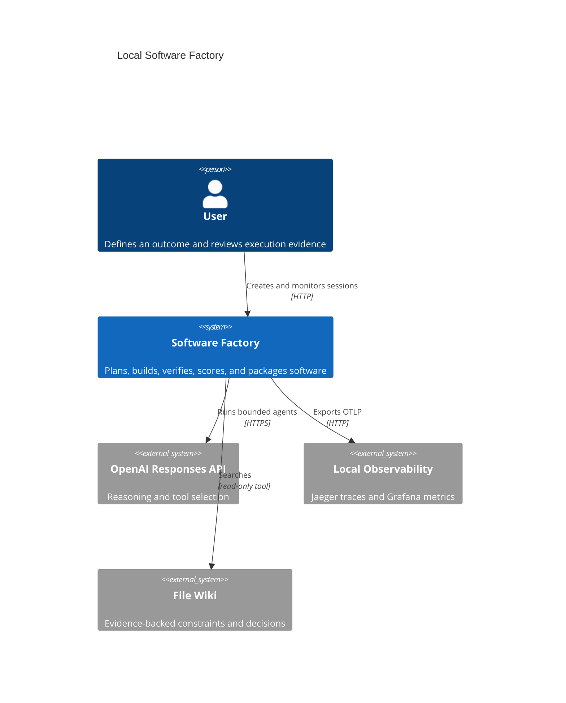
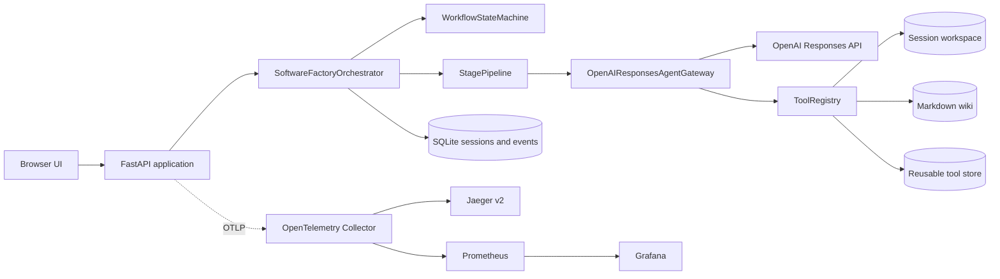
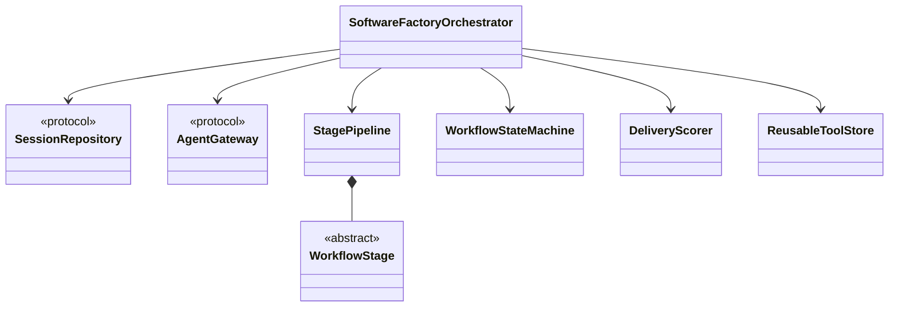
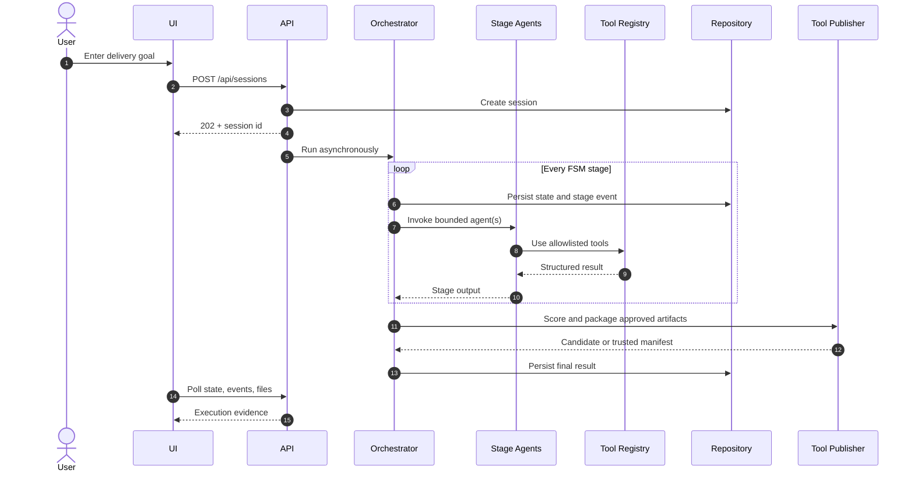
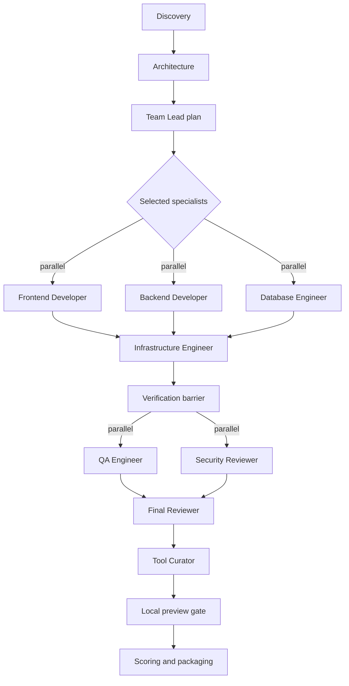
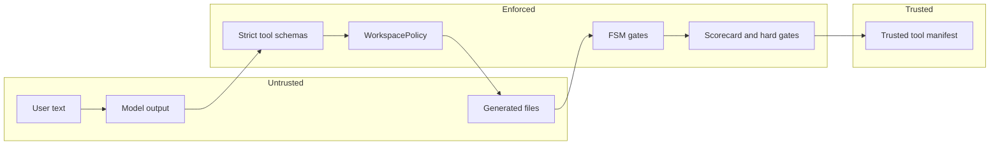
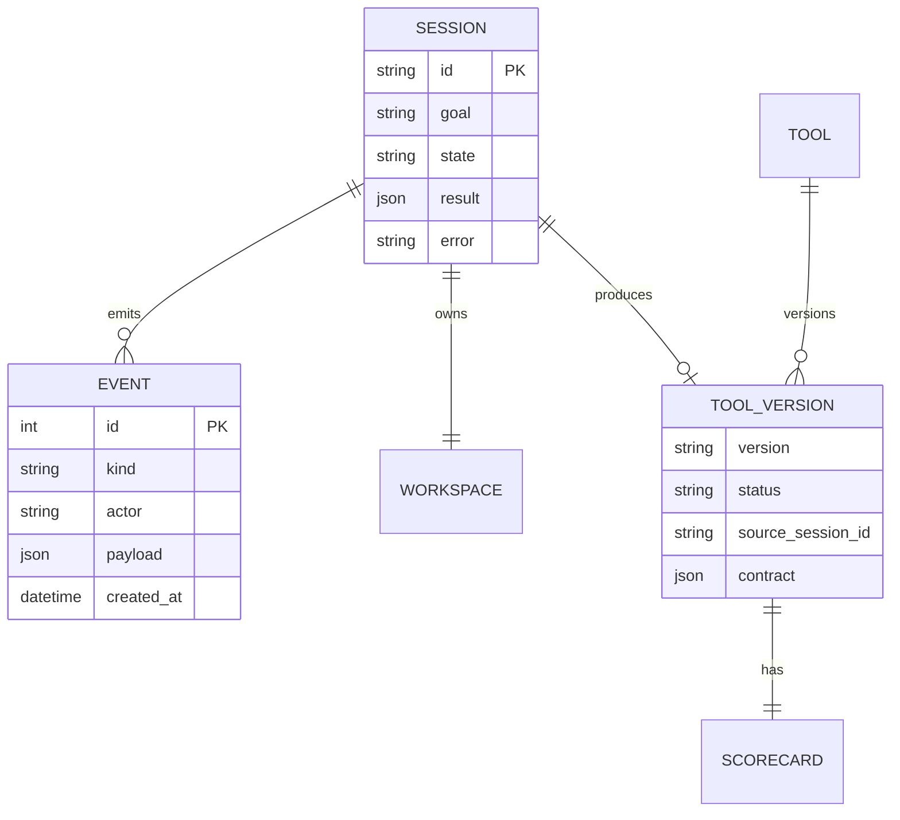

# Software Factory Architecture

## Purpose

The Software Factory turns a user goal into locally runnable software through an explicit,
observable finite-state workflow. A manager-style orchestrator retains control while specialist
agents receive narrow prompts and tools. Approved outputs are evaluated and packaged as reusable
templates for later sessions. The file wiki remains an evidence source, not the workflow engine.

## System Context

## Container View

## Runtime Components

| Component | Responsibility | Must not do |
| --- | --- | --- |
| FastAPI | Validate HTTP input and expose session state | Contain workflow policy |
| Orchestrator | Own lifecycle, events, gates, and failures | Implement specialist work |
| FSM | Enforce legal transitions | Infer or skip stages |
| Stage | Coordinate one bounded phase | Access OpenAI directly |
| Agent gateway | Run Responses API tool loops | Grant undeclared tools |
| Tool registry | Validate and execute tool contracts | Allow path escape or secrets |
| Agent spec | Declare role, prompt, and tool allowlist | Own durable state |
| Repository | Persist deterministic state and events | Store API credentials |
| Tool store | Publish and apply evaluated templates | Trust unscored output |

## Dependency Direction

Domain policy depends on protocols. Infrastructure implements them. The orchestrator is testable
with a deterministic fake gateway, so the HTTP and OpenAI SDKs do not become the architecture.

## End-to-End Sequence

## Concurrency Model

Concurrency is allowed only inside a stage. The next state starts after an explicit barrier. Role
ownership prevents concurrent writers from modifying the same top-level path.

## Trust Boundaries

Model output is never trusted merely because it is well formatted. Tool inputs are schema-bound,
paths stay beneath a session workspace, sensitive names are blocked, writers have role ownership,
reviewers fail closed, and reusable status requires deterministic hard gates. Verification is also
machine-gated: QA and Security must emit explicit pass verdicts as their first non-empty lines. A
blocked or missing verdict enters a bounded remediation loop before final review. The loop sends
both reports to the implementation roles selected by the original plan, refreshes the release
contract, and reruns verification. It fails closed after two unsuccessful repair attempts.

For JavaScript frontends, runtime verification rejects floating `latest` versions, preserves a
generated lockfile when needed, installs with `npm ci --ignore-scripts`, and removes only transient
`node_modules` after execution. The same lockfile is reused by the preview build.

## Persistence

SQLite is the PoC control-plane store. Files remain in isolated session workspaces. Published
templates live under `.factory/tools/<tool-id>/<version>/` with immutable provenance.

New roles require an English Markdown specification, narrow tool allowlist, and explicit stage.
New tools subclass `FactoryTool` and publish strict JSON schemas. New stages subclass
`WorkflowStage` and declare state, mode, agents, and gate.
