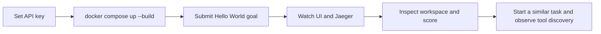

# Local Factory Development

## Start on Windows

1. Copy `.env.example` to `.env` and set `OPENAI_API_KEY`.
2. Run `powershell -ExecutionPolicy Bypass -File scripts/start-factory.ps1 -Build`.
3. Open `http://localhost:8000`.
4. Enter: `Create an accessible Hello World page that runs locally without external dependencies.`
5. Watch stages, concurrent agents, artifacts, score dimensions, and tool publication.

The browser also accepts English Markdown/text prompt sources. Every session exposes a downloadable
YAML artifact, the generated project opens through a session preview URL, and the Evaluation panel
compares the latest two completed runs. The exported workspace includes `deploy/compose.yaml`.



## Verify Services

```powershell
docker compose ps
Invoke-RestMethod http://localhost:8000/api/health
Invoke-RestMethod http://localhost:8000/api/workflow
```

In Jaeger select service `llm-wiki-factory` and search the last hour. In Grafana select the
provisioned `Software Factory Overview` dashboard. Prometheus target health is at
`http://localhost:9090/targets`.

Docker stores sessions and tools in `factory-data`. For host-native development install
`.[factory,dev]`, set `FACTORY_DATA_DIR=.factory`, and run `llm-wiki-factory`.

Generated workspaces use `.factory/workspaces/<session-id>/`. Reusable versions use
`.factory/tools/<tool-id>/<version>/`. Do not put secrets in either location.

## Generated Preview

`Open generated project` serves static HTML directly. When a session contains a Vite project, the
preview gate installs its declared frontend dependencies, runs a production Vite bundle with a
relative asset base, removes temporary `node_modules`, and serves `frontend/dist`. The first open
can take longer because packages must be downloaded; later opens reuse the compiled output.

The preview returns HTTP `503` with the bounded build output when dependency installation or
bundling fails. It never silently serves a source `index.html` that still references TSX files.

## OpenAI Key

Create `.env` locally from `.env.example` and set `OPENAI_API_KEY`. `.env` is ignored by Git. Never
paste the key into a prompt, upload it to the wiki, or commit it. `OPENAI_MODEL` and
`OPENAI_REASONING_EFFORT` are optional. OpenAI is the only external LLM API used by the factory.

Stop with `docker compose down`. Use `docker compose down -v` only when intentionally deleting all
local sessions, metrics, and dashboards.
