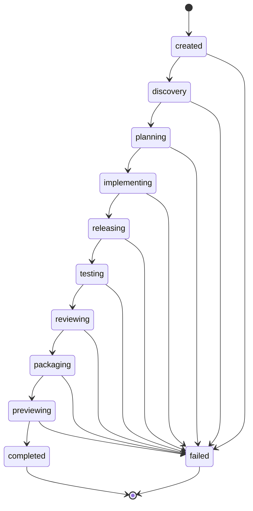
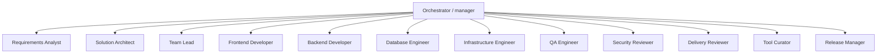
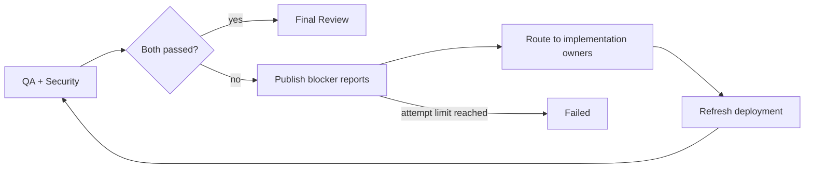
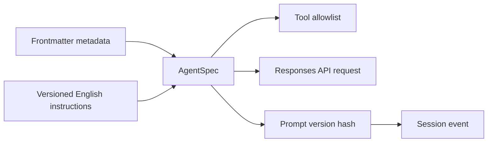

# FSM and Agent Network

Every transition is persisted before work begins. Exceptions move the current non-terminal state
to `failed`; no stage is silently skipped and no failed session publishes a trusted tool.

| State | Agent topology | Gate |
| --- | --- | --- |
| discovery | Requirements Analyst | Testable scope and acceptance criteria |
| planning | Architect then Team Lead | Valid plan with supported roles |
| implementing | Selected developers in parallel | Owned artifacts and reports |
| releasing | Infrastructure Engineer | Docker and preview manifests |
| testing | QA and Security in parallel | Explicit `QA PASSED` and `SECURITY PASSED` verdicts |
| reviewing | Delivery Reviewer | Verdict begins with `APPROVED` |
| packaging | Tool Curator | Strict reuse contract |
| previewing | Release Manager | Verified localhost preview URL |

## Manager Pattern

Agents do not hand control to one another. The orchestrator retains state, composition, failure
semantics, and the final result while specialists keep focused context and tools.

## Verification Verdict Contract

QA and Security reports are both human-readable and machine-gated. Their first non-empty lines must
be one of the following values:

| Agent | Pass | Stop |
| --- | --- | --- |
| QA Engineer | `QA PASSED` | `QA BLOCKED` |
| Security Reviewer | `SECURITY PASSED` | `SECURITY BLOCKED` |

A missing, malformed, or blocked verdict prevents the Verification stage from passing. The stage
does not immediately proceed to final review. Instead, it emits the blocker reports, invokes every planned
implementation owner with the QA and Security evidence, reruns Release Engineering, and repeats
Verification. The loop allows two remediation attempts. If both attempts remain blocked, the
session fails and the final reviewer is not invoked. Static inspection cannot produce `QA PASSED`
when runtime evidence is required.

The timeline records `verification-blocked`, `remediation-started`, `remediation-completed`,
`remediation-passed`, and `remediation-exhausted` events. The UI exposes the full QA and Security
reports on each blocked attempt.

## Prompt Contract

Prompts are repository-owned configuration. Completed agent events record a content hash so quality
and cost can be compared by prompt version without exporting prompt contents as telemetry.

## Adding an Agent

1. Create `agent_specs/<role>.md` with YAML frontmatter and English instructions.
2. Grant only the tools required by that role.
3. Assign it to a stage or the Team Lead supported-role parser.
4. Define its write root in `WorkspacePolicy` if it mutates files.
5. Add a deterministic fake response to the orchestration test.
6. Add representative eval cases before changing production prompt behavior.
