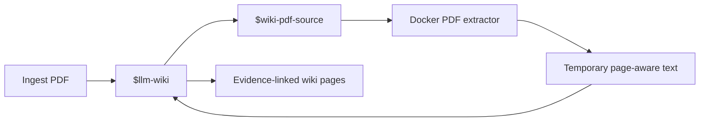

# Local Testing

This guide verifies the project in two stages:

1. The Docker toolkit performs deterministic file operations.
2. Codex uses `$llm-wiki` and source adapters to compile and query knowledge.

The Docker toolkit does not call an LLM and does not create semantic wiki pages by itself. Codex is
required for entity resolution, concept extraction, synthesis, contradiction review, and cited
answers.

## Recommended first document

Start with `examples/architecture.md`. It is short, deterministic, already tracked, and contains:

- a concrete architecture decision;
- named concepts that can become wiki pages;
- explicit provenance requirements;
- a statement suitable for a cited query.

After the Markdown workflow succeeds, test one small text-based PDF that you own. Prefer a 3–20 page
design note, decision record, specification, or meeting summary with headings and page numbers. Do
not start with a scanned PDF because bundled OCR is not currently available.

## 1. Verify Docker

From the repository root in PowerShell:

```powershell
docker version
docker info
```

Both commands must show a working Docker client and server. If `docker` is not found, restart the
terminal after installing Docker Desktop. If the client exists but the server is unavailable, start
Docker Desktop and wait until its engine is ready.

## 2. Build and initialize

```powershell
Set-ExecutionPolicy -Scope Process Bypass
.\scripts\bootstrap.ps1
```

Expected result:

```text
LLM Wiki workspace initialized.
Open Codex here and invoke $llm-wiki, or ask it to ingest a file.
```

Verify the containerized CLI:

```powershell
docker run --rm --volume "${PWD}:/workspace" llm-wiki:local --root /workspace status
```

Expected initial shape:

```json
{
  "root": "/workspace",
  "sources": 0,
  "pages": 0,
  "issues": 0
}
```

Source and page counts may be greater than zero when the workspace was used previously.

## 3. Smoke-test deterministic extraction

```powershell
docker run --rm --volume "${PWD}:/workspace" llm-wiki:local --root /workspace `
  extract /workspace/examples/architecture.md
```

The command should print the example document unchanged as extracted text. This verifies the image,
bind mount, CLI entry point, and plain-text extractor. It does not ingest the document into the wiki.

Run structural validation:

```powershell
docker run --rm --volume "${PWD}:/workspace" llm-wiki:local --root /workspace lint
```

Expected result:

```json
{
  "issues": [],
  "count": 0
}
```

## 4. Run the full agent workflow

Open Codex in the repository root. Confirm that `$llm-wiki` appears in the available skills, then
send:

```text
$llm-wiki ingest examples/architecture.md
```

The agent should:

1. Initialize the workspace when required.
2. Register a content-addressed copy under `raw/`.
3. Read the registered source and existing wiki state.
4. Create or update a source page and relevant knowledge pages.
5. Add evidence anchors and raw source locations.
6. Rebuild `wiki/index.md` and `graph/graph.json`.
7. Run deterministic lint and append an ingest entry to `wiki/log.md`.

Inspect the result:

```powershell
Get-ChildItem wiki -Recurse
Get-Content wiki\index.md
Get-Content wiki\log.md
Get-Content graph\graph.json
```

Page names are semantic decisions and may vary. Correctness is defined by traceable evidence,
non-duplicated concepts, valid links, and a clean lint result rather than exact filenames.

## 5. Test querying

Ask Codex:

```text
What does the wiki say about the primary knowledge store? Cite the exact evidence.
```

A correct answer should mention the file-based Markdown workspace, cite the compiled source page,
and expose the underlying raw location. It should not cite another generated entity or concept page
as the sole evidence.

Then ask an unsupported question:

```text
Which cloud provider hosts this system?
```

The correct behavior is to say that the available evidence does not answer the question. The agent
must not infer a provider.

## 6. Test contradiction handling

Ingest the intentionally conflicting example:

```text
$llm-wiki ingest examples/conflicting-architecture.md
```

Then request review:

```text
$llm-wiki check the wiki for contradictions and stale claims.
```

The agent should retain both sources, identify that they name different primary knowledge stores,
and mark the conflict explicitly. It must not silently overwrite the earlier claim.

## 7. Test source-skill routing

Copy a small text-based PDF into the repository, for example `samples/design-note.pdf`, and run:

```text
$llm-wiki ingest samples/design-note.pdf and preserve page-level citations.
```

Expected routing:



The final wiki evidence should cite the registered PDF and page number, not the cache file. For a
DOCX or PPTX source, Codex should choose `$wiki-office-source`. For XLSX, CSV, or TSV, it should
choose `$wiki-tabular-source`.

## 8. Final verification

```powershell
docker run --rm --volume "${PWD}:/workspace" llm-wiki:local --root /workspace index
docker run --rm --volume "${PWD}:/workspace" llm-wiki:local --root /workspace graph
docker run --rm --volume "${PWD}:/workspace" llm-wiki:local --root /workspace lint
docker run --rm --volume "${PWD}:/workspace" llm-wiki:local --root /workspace status
```

The test is successful when:

- raw sources are content-addressed and unchanged;
- wiki pages have required frontmatter;
- factual claims link to source evidence anchors;
- `lint` returns zero issues;
- `graph/graph.json` contains the expected nodes and wikilink edges;
- supported questions receive cited answers;
- unsupported questions and conflicts remain explicit.

## Current capabilities

| Area | Available now |
|---|---|
| Sources | Markdown, text, RST, XML, YAML, JSON, CSV, TSV, PDF, DOCX, PPTX, XLSX |
| Registration | Immutable SHA-256-addressed copies and local source state |
| Knowledge | Source, entity, concept, and synthesis Markdown pages |
| Provenance | Evidence anchors and raw source locations |
| Retrieval | Lexical search over compiled wiki pages and wikilink traversal |
| Review | Deterministic lint plus agent-led contradiction and freshness review |
| Artifacts | Generated Markdown index, JSON graph, and append-only activity log |
| Routing | Automatic PDF, Office, and tabular source adapter selection |

## Not implemented yet

- OCR for scanned PDFs or images;
- semantic embeddings or hybrid retrieval;
- a web UI, HTTP API, database, or background service;
- multi-writer locking;
- scheduled freshness refresh;
- fully automated semantic correctness evaluation.
