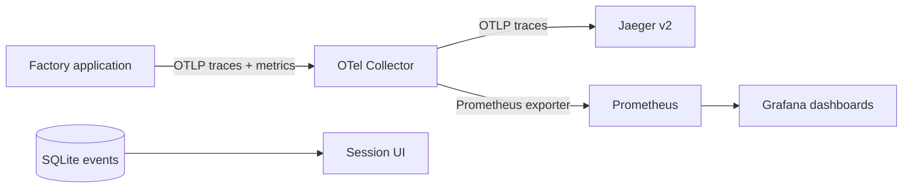
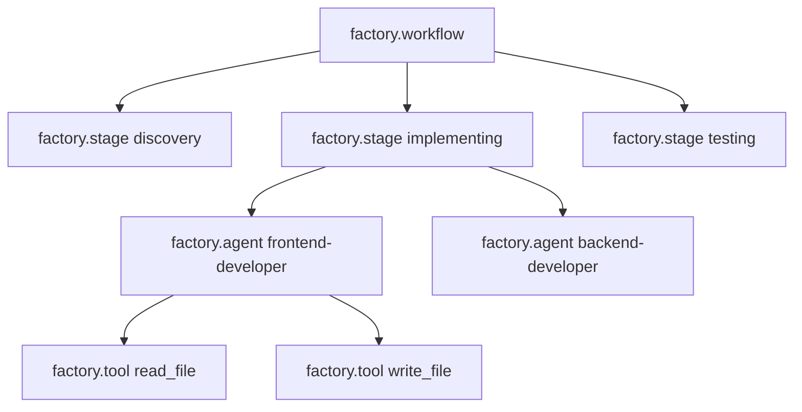
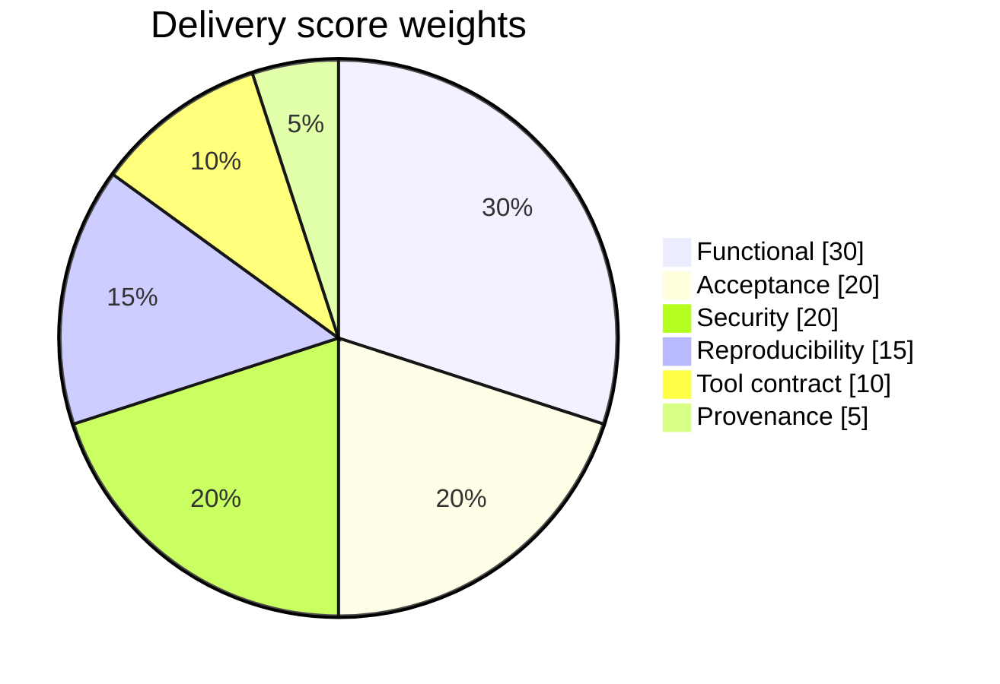
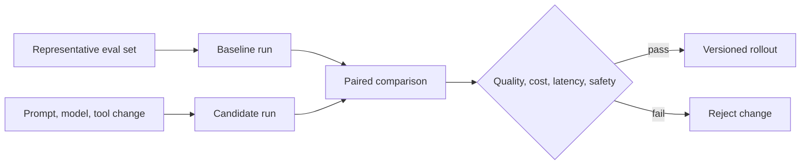

# Observability and Scoring

Observability answers what happened; evaluation answers whether it was good. They share stable
identifiers but are not interchangeable. Telemetry excludes user prompts, generated source, API
keys, and model reasoning content.

## Trace Hierarchy

Every span carries low-cardinality attributes such as session id, stage, agent id, mode, tool name,
and outcome. Prompts and file content stay inside the local event/workspace boundary.

## Metrics

| Metric | Type | Dimensions | Purpose |
| --- | --- | --- | --- |
| `factory.sessions` | counter | terminal state | Throughput and failure rate |
| `factory.agent.duration` | histogram | agent | Latency percentiles |
| `factory.tool.calls` | counter | agent | Tool-loop intensity |
| `factory.tool.duration` | histogram | agent, tool, outcome | Tool reliability and latency |
| `factory.openai.tokens` | counter | agent, type | Input, output, and cached tokens |
| `factory.delivery.score` | histogram | status | Quality distribution |

Events additionally record stage duration, prompt version hash, tool-call count, token counts,
reviewer output, artifacts, score dimensions, and tool provenance. A `search_wiki` span measures wiki
use without exporting retrieved evidence.

## Initial Scorecard

| Dimension | Weight | Current signal |
| --- | ---: | --- |
| Functional | 30% | QA reports passing execution and artifacts exist |
| Acceptance | 20% | Final reviewer approves |
| Security | 20% | No critical/high finding is reported |
| Reproducibility | 15% | Test artifacts exist |
| Tool contract | 10% | Curator marks the template reusable |
| Provenance | 5% | Session and score are in the manifest |

Trusted status requires score `>= 0.80` plus reviewer approval, no critical security finding,
reusable curator verdict, and passing tests with test artifacts. Otherwise status is `candidate`.

## Calibration

These weights are a transparent PoC baseline, not a universal quality claim. Model-authored reports
can be gamed. Before production, calibrate thresholds on golden tasks, record human labels, add
executable acceptance checks, track false-promotion rate, and compare changes with paired evals.

Local endpoints: Factory `:8000`, Jaeger `:16686`, Grafana `:3000`, Prometheus `:9090`.
