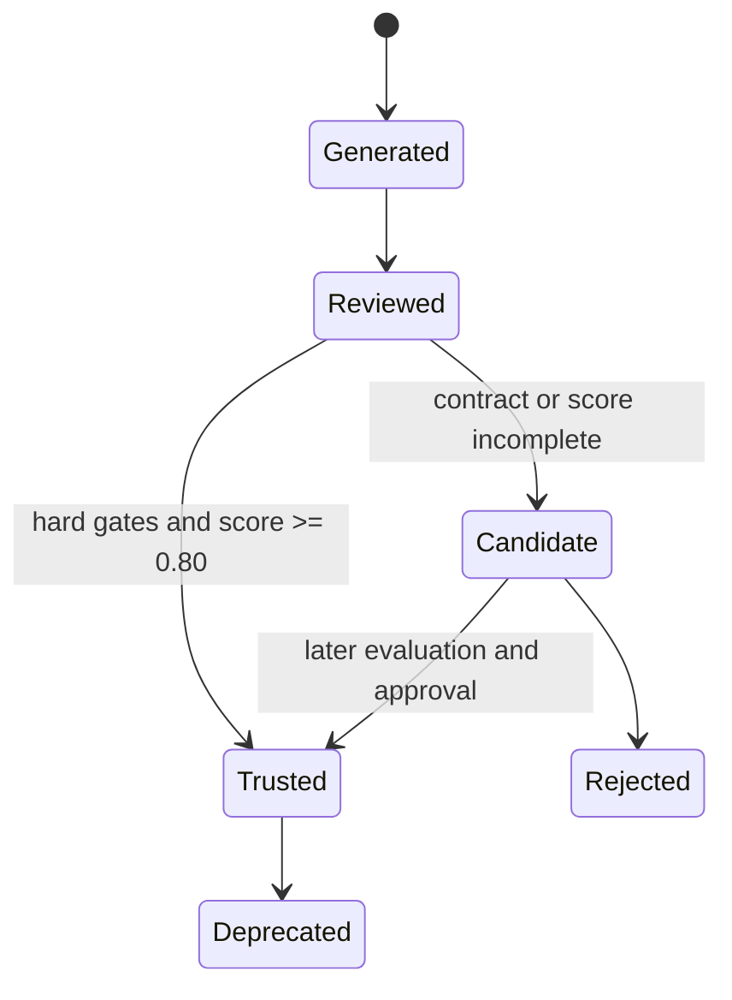
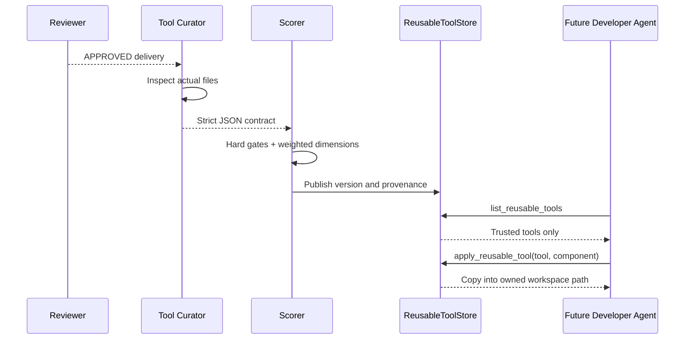
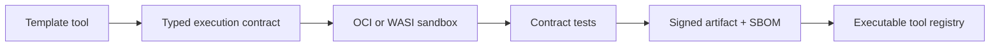

# Reusable Tool Lifecycle

A successful delivery is useful twice: first as user output, then as a candidate capability. The
PoC packages approved artifacts as versioned templates. It does not pretend arbitrary generated
applications have a safe executable function interface.

## Publication Flow

Each `.factory/tools/<id>/<version>/tool.json` contains schema version, stable id, derived version,
status, source session, curator contract, scorecard, and available components. `payload/` contains
only supported roots: `frontend`, `backend`, `database`, `deploy`, and `tests`.

## Reuse Safety

- Agents discover only `trusted` versions.
- Application copies only the component matching the caller's write boundary.
- Agents inspect existing files before applying a template.
- Secrets and `.git` cannot be accessed through file tools.
- Reuse preserves origin and score provenance.
- Production promotion should add human or offline evaluation approval.

## Future Executable Tools

Executable generated tools require a separate sandbox, resource limits, dependency locking, SBOM,
signature, permissions, and conformance suite. Those controls are outside this PoC rather than
being simulated insecurely.
