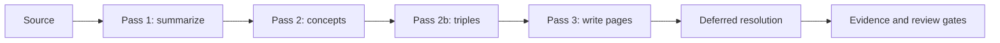
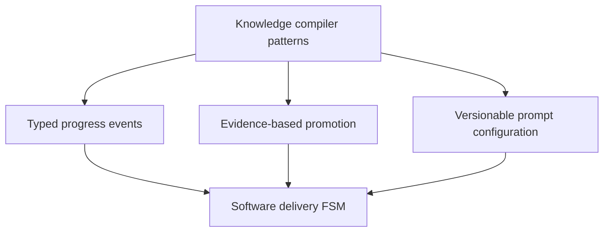

# Sage Wiki Reference Analysis

The design review used `xoai/sage-wiki` tag `v0.2.9` as an architectural reference, not a code
dependency. Its strongest transferable ideas are explicit compiler passes, budget checks between
passes, typed non-blocking progress events, resumable jobs, prompt overrides, evidence gates, and a
quarantine-to-trust lifecycle.

| Sage Wiki concept | Factory adaptation |
| --- | --- |
| Compiler pass | FSM stage |
| Progress event | Session event |
| Job state | Factory session state |
| Prompt registry | Markdown agent specification repository |
| Evidence gate | QA, Security, and Reviewer gates |
| Quarantine/promotion | Candidate/trusted generated tool |
| Budget guard | Tool-round cap and future session budgets |

The factory does not copy Sage Wiki's knowledge model. Wiki compilation remains file-first; the
factory consumes wiki evidence through a read-only tool while producing software and templates.
