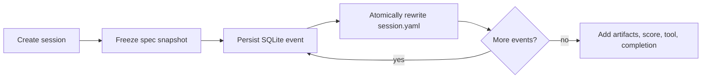
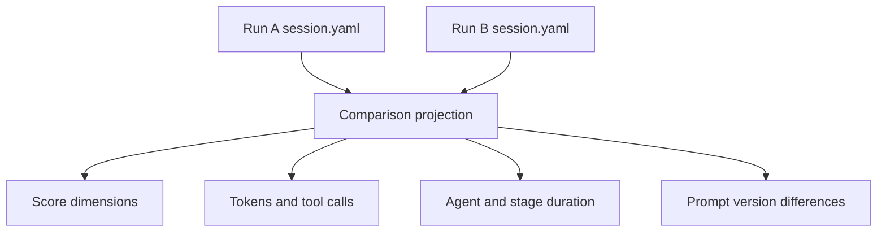

# Session Artifact Specification

Every run owns `.factory/workspaces/<session-id>/session.yaml`. The file exists before the first
agent starts and is atomically materialized after every persisted event. SQLite remains the
append-only event source of truth; YAML is the portable, human-reviewable run artifact.

## Envelope

```yaml
apiVersion: factory.llm-wiki.dev/v1alpha1
kind: SoftwareFactorySession
metadata:
  name: 01example
  createdAt: 2026-08-19T12:00:00+00:00
  labels:
    factory.llm-wiki.dev/state: implementing
spec:
  goal: Create an accessible Hello World page.
  model: gpt-5.6-terra
  reasoningEffort: medium
  knowledge:
    sources: 4
    pages: 4
    issues: 0
    revision: 25a89bf1a3624f77
  workflow: []
  agents: []
status:
  phase: implementing
  updatedAt: 2026-08-19T12:01:00+00:00
  completedAt: null
  eventCount: 7
  timeline: []
  agentResults: {}
  metrics: {}
  artifacts: []
  scorecard: null
  reusableTool: null
  error: null
```

`spec` is the immutable starting snapshot: user goal, model configuration, wiki revision, full FSM
stage catalog, every available agent, prompt version hash, and exact tool allowlist. `status` is observed
execution: phase, timeline, agent results, aggregate metrics, produced files, score, reusable tool,
and failure details.



## Metrics Contract

| Field | Meaning |
| --- | --- |
| `agentDurationMs` | Sum of wall-clock agent durations; parallel time may overlap |
| `stageDurationMs` | Sum of stage wall-clock durations |
| `toolCalls` | Model-issued tool calls |
| `inputTokens` | OpenAI input tokens |
| `outputTokens` | OpenAI output tokens |
| `cachedTokens` | Cached OpenAI input tokens |

## Run Comparison

`GET /api/session-comparisons?ids=<id>&ids=<id>` returns normalized comparison records: goal,
model, reasoning effort, prompt versions, phase, metrics, scorecard, and reusable tool. Compare
runs on paired goals when evaluating prompt or model changes; unrelated goals are not meaningful
quality comparisons.



The `v1alpha1` version signals that fields can evolve. Breaking schema changes require a new
`apiVersion`; readers must ignore unknown fields and must not infer success from file presence.
